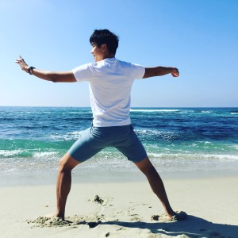

# Edward Liaw

An attempt to organize and develop my notes on taiji and other subjects of interest.

[[z:zettels?tag=timeline/**&timeline]]

## About me {#avatar .ui .right .floated .small .circular .image}

Hi, I'm Edward.
Professionally, I work as a software engineer for bioinformatics applications and data pipelines.
My daily practice is Chen-style Taijiquan [[practicalmethod]]: I am a disciple of [[chenzhonghua]].

I've created this blog using Srid's [neuron-template](https://github.com/srid/neuron-template) for [Zettelkasten](https://zk.zettel.page/zettelkasten.html).
